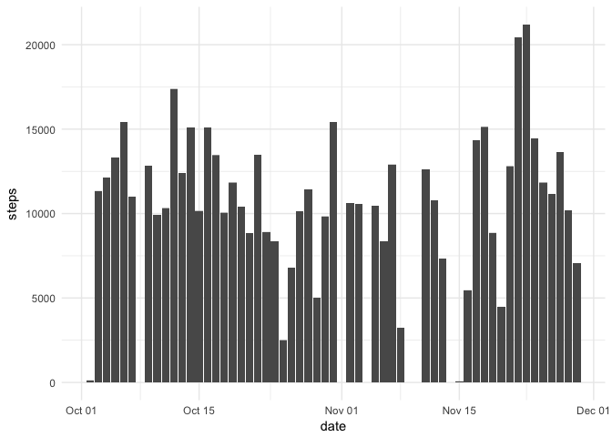
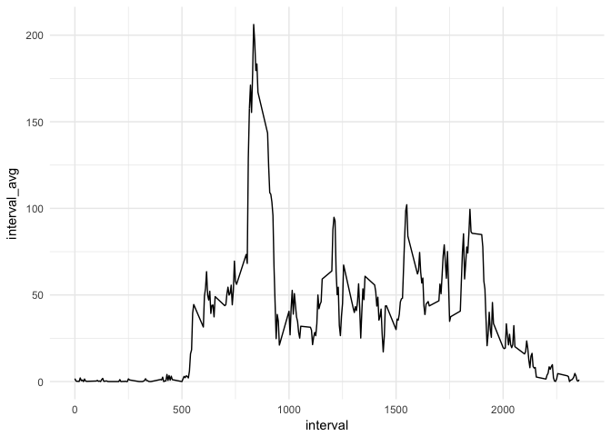
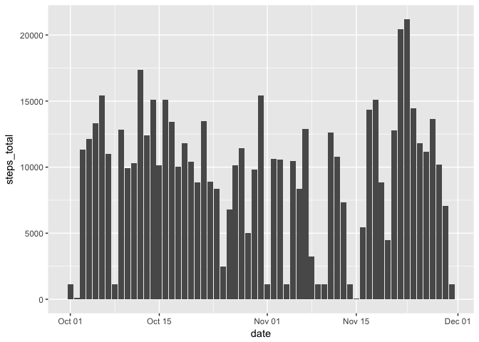
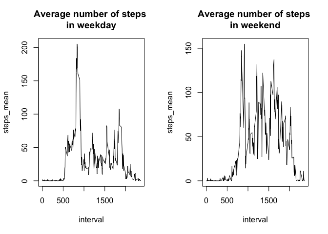

## Loading and preprocessing the data

```r
library(tidyverse)
if (!file.exists("activity.csv")) {
        unzip("activity.zip")}
activity <- read_csv("activity.zip")
```

```
## Parsed with column specification:
## cols(
##   steps = col_integer(),
##   date = col_date(format = ""),
##   interval = col_integer()
## )
```


## What is mean total number of steps taken per day?

Total number of steps taken per day.

```r
activity %>%
        group_by(date) %>%
        summarise(steps_total = sum(steps)) %>%
        print(type = "html")
```

```
## # A tibble: 61 x 2
##          date steps_total
##        <date>       <int>
##  1 2012-10-01          NA
##  2 2012-10-02         126
##  3 2012-10-03       11352
##  4 2012-10-04       12116
##  5 2012-10-05       13294
##  6 2012-10-06       15420
##  7 2012-10-07       11015
##  8 2012-10-08          NA
##  9 2012-10-09       12811
## 10 2012-10-10        9900
## # ... with 51 more rows
```

Make a histogram of the total number of steps taken each day.

```r
ggplot(activity, aes(date, steps)) +
        geom_histogram(stat = "identity") +
        theme_minimal()
```

```
## Warning: Ignoring unknown parameters: binwidth, bins, pad
```

```
## Warning: Removed 2304 rows containing missing values (position_stack).
```

<!-- -->

Calculate and report the mean and median of the total number of steps taken per day.

```r
activity %>%
        group_by(date) %>%
        summarise(steps_total = sum(steps)) %>%
        ungroup() %>%
        summarise(steps_mean = mean(steps_total, na.rm = TRUE),
                  steps_median = median(steps_total, na.rm = TRUE))
```

```
## # A tibble: 1 x 2
##   steps_mean steps_median
##        <dbl>        <int>
## 1   10766.19        10765
```


## What is the average daily activity pattern?
Make a time series plot (i.e. 𝚝𝚢𝚙𝚎 = "𝚕") of the 5-minute interval (x-axis) and the average number of steps taken, averaged across all days (y-axis)

```r
activity %>%
        group_by(interval) %>%
        summarize(interval_avg = mean(steps, na.rm = TRUE)) %>%
        ggplot(aes(interval, interval_avg)) +
                 geom_line(stat = "identity") +
                 theme_minimal()
```

<!-- -->
Which 5-minute interval, on average across all the days in the dataset, contains the maximum number of steps?

```r
activity %>%
        group_by(interval) %>%
        summarize(interval_avg = mean(steps, na.rm = TRUE)) %>%
        filter(interval_avg == max(interval_avg)) %>%
        .[[1]]
```

```
## [1] 835
```


## Imputing missing values

Calculate and report the total number of missing values in the dataset (i.e. the total number of rows with 𝙽𝙰.s).

```r
activity %>%
        mutate_all(is.na) %>%
        summarise_all(sum)
```

```
## # A tibble: 1 x 3
##   steps  date interval
##   <int> <int>    <int>
## 1  2304     0        0
```

Devise a strategy for filling in all of the missing values in the dataset. The strategy does not need to be sophisticated. For example, you could use the mean/median for that day, or the mean for that 5-minute interval, etc.
Create a new dataset that is equal to the original dataset but with the missing data filled in.

```r
replacement <- activity %>%
        group_by(interval) %>%
        summarize(steps_median = median(steps, na.rm = TRUE))
activity_nona <- activity
for (i in replacement$interval) {
        activity_nona$steps[activity_nona$interval == i & is.na(activity_nona$steps)] <- replacement$steps_median[replacement$interval == i]
}
```

Make a histogram of the total number of steps taken each day and Calculate and report the mean and median total number of steps taken per day. Do these values differ from the estimates from the first part of the assignment? What is the impact of imputing missing data on the estimates of the total daily number of steps?

```r
activity_nona %>%
        group_by(date) %>%
        summarise(steps_total = sum(steps)) %>%
        ggplot(aes(date, steps_total)) +
                 geom_histogram(stat = "identity")
```

```
## Warning: Ignoring unknown parameters: binwidth, bins, pad
```

<!-- -->

```r
activity_nona %>%
        group_by(date) %>%
        summarise(steps_total = sum(steps)) %>%
        summarise(steps_mean = mean(steps_total),
                  steps_median = median(steps_total)) %>%
        ungroup()
```

```
## # A tibble: 1 x 2
##   steps_mean steps_median
##        <dbl>        <int>
## 1   9503.869        10395
```


## Are there differences in activity patterns between weekdays and weekends?

Create a new factor variable in the dataset with two levels – “weekday” and “weekend” indicating whether a given date is a weekday or weekend day.


```r
library(lubridate)

activity_nona <- activity_nona %>%
        mutate(day_type = ifelse(wday(date) %in% c(7, 1), "weekend", "weekday"))
```

Make a panel plot containing a time series plot (i.e. ) of the 5-minute interval (x-axis) and the average number of steps taken, averaged across all weekday days or weekend days (y-axis). See the README file in the GitHub repository to see an example of what this plot should look like using simulated data.


```r
activity_nona <- activity_nona %>%
        group_by(day_type, interval) %>%
        summarise(steps_mean = mean(steps))

max_steps <- max(activity_nona$steps_mean)
par(mfrow = c(1, 2))
with(activity_nona[activity_nona$day_type == "weekday",], plot(interval, steps_mean, type = "l"), ylim = c(0, 206))
title("Average number of steps \nin weekday")

with(activity_nona[activity_nona$day_type == "weekend",], plot(interval, steps_mean, type = "l"), ylim = c(0, 206))
title("Average number of steps \nin weekend")
```

<!-- -->


